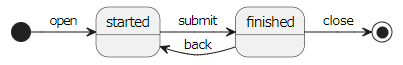
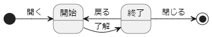

# Convert State Diagram of PlantUML/Mermaid format to State and N-switch Coverage Tables of Markdown format, and Copy it

---

* [English](#english)

* [Japanese](#japanese)

---

# English

This is the extension of Visual Studio Code that creates a state transition table and N-switch coverage table in Markdown format from a state diagram written in PlantUML/Mermaid format and copies them to the clipboard.

## Features

From the text of a state transition diagram in PlantUML/Mermaid format as follows (examples are from PlantUML)

```
@startuml
[*] -right-> started : open
started -right-> finished : submit
finished -left-> started : back
finished -right-> [*] : close
@enduml
```

You can create following state transition and N-switch coverage tables in Markdown table format 

```markdown
## Transition Table

| |open|submit|back|close|
| :----: | :----: | :----: | :----: | :----: |
|[*]|started|N/A|N/A|N/A|
|started|N/A|finished|N/A|N/A|
|finished|N/A|N/A|started|[*]|

## 0 Switch Coverage

|state|event|state|
| :----: | :----: | :----: |
|[*]|open|started|
|started|submit|finished|
|finished|back|started|
|finished|close|[*]|

## 1 Switch Coverage

|state|event|state|event|state|
| :----: | :----: | :----: | :----: | :----: |
|[*]|open|started|submit|finished|
|started|submit|finished|back|started|
|started|submit|finished|close|[*]|
|finished|back|started|submit|finished|
```

The rendering result of state diagram of PlantUML is used to illustrate below.



It means that, from the above diagram, you can create tables below.

## Transition Table

| |open|submit|back|close|
| :----: | :----: | :----: | :----: | :----: |
|[*]|started|N/A|N/A|N/A|
|started|N/A|finished|N/A|N/A|
|finished|N/A|N/A|started|[*]|

## 0 Switch Coverage

|state|event|state|
| :----: | :----: | :----: |
|[*]|open|started|
|started|submit|finished|
|finished|back|started|
|finished|close|[*]|

## 1 Switch Coverage

|state|event|state|event|state|
| :----: | :----: | :----: | :----: | :----: |
|[*]|open|started|submit|finished|
|started|submit|finished|back|started|
|started|submit|finished|close|[*]|
|finished|back|started|submit|finished|

The order in tables is as close as possible to the order in the text of diagram.  
(Items related to `[*]` are placed at the beginning or end of the table as much as possible)

## How to install

You can get the VSIX file from the below

https://github.com/yoichi-ihara/StateDiagram2MarkdownTables/releases

and install it.

## Usage

The usage is as follows:

1. Select the text of  PlantUML/Mermaid state diagram that you wish to convert
1. Execute the `State Diagram 2 Markdown Tables And Copy` command from the command palette
1. The converted text will be copied to the clipboard, and you can paste it wherever you want to use it.

This extension supports the below format of the state diagram text of PlantUML/Mermaid.

```
state1 --> state2 : event
```

If there is no event text, as in the following format, this extension will not convert it.
(On the one hand, this format can be used to exclude starting/ending states from tables!)

```
state1 --> state2
```

Also, If the alias of the state is specified in the following format, the alias will also be used in the converted name.
```
state "alias_name" as state_name
```

Formats other than the above, such as composite states, history, fork, and conditional choice, are not supported.

## Requirements

No requirements.

However, if you want to preview state diagram of PlantUML in Visual Studio Code, please include following extensions.

- [Markdown Preview Enhanced](https://marketplace.visualstudio.com/items?itemName=shd101wyy.markdown-preview-enhanced)
- [PlantUML](https://marketplace.visualstudio.com/items?itemName=jebbs.plantuml)

Both require [Java](http://java.com/en/download/) and [Graphviz](https://www.graphviz.org/) installed.

Markdown Preview Enhanced also supports previewing Mermaid diagrams.

## Extension Settings

* `stateDiagram2MarkdownTables.nSwitchCoveragesDepth`: Specifies the depth of N-switch Converages Tables(the number of depth is the number of tables)

## Known Issues

None at this time.

## Release Notes

### 0.1.3

Fixed a bug of 0.1.2, that cannot handle event names of less than 2 characters.

### 0.1.2

Fixed to handle event names that contain spaces.

### 0.1.1

English documentation is now available.

### 0.1.0

Initial release.

---

# Japanese

PlantUML/Mermaid 形式で書いた状態遷移図から、Markdown 形式の状態遷移表と N-スイッチカバレッジ表を作成してクリップボードにコピーする Visual Studio Code の拡張機能です。

## Features
次のような PlantUML/Mermaid 形式での状態遷移図のテキストから（例は PlantUMLのもの）

```
@startuml
[*] -right-> 開始 : 開く
開始 -right-> 終了 : 了解
終了 -left-> 開始 : 戻る
終了 -right-> [*] : 閉じる
@enduml
```

次のような Markdown の表形式での状態遷移表と N-スイッチカバレッジ表を作成することができます。

```markdown
## Transition Table

| |開く|了解|戻る|閉じる|
| :----: | :----: | :----: | :----: | :----: |
|[*]|開始|N/A|N/A|N/A|
|開始|N/A|終了|N/A|N/A|
|終了|N/A|N/A|開始|[*]|

## 0 Switch Coverage

|state|event|state|
| :----: | :----: | :----: |
|[*]|開く|開始|
|開始|了解|終了|
|終了|戻る|開始|
|終了|閉じる|[*]|

## 1 Switch Coverage

|state|event|state|event|state|
| :----: | :----: | :----: | :----: | :----: |
|[*]|開く|開始|了解|終了|
|開始|了解|終了|戻る|開始|
|開始|了解|終了|閉じる|[*]|
|終了|戻る|開始|了解|終了|
```

仕上がりでいうと



という状態遷移図から、次のような表を作ることができます。

## Transition Table

| |開く|了解|戻る|閉じる|
| :----: | :----: | :----: | :----: | :----: |
|[*]|開始|N/A|N/A|N/A|
|開始|N/A|終了|N/A|N/A|
|終了|N/A|N/A|開始|[*]|

## 0 Switch Coverage

|state|event|state|
| :----: | :----: | :----: |
|[*]|開く|開始|
|開始|了解|終了|
|終了|戻る|開始|
|終了|閉じる|[*]|

## 1 Switch Coverage

|state|event|state|event|state|
| :----: | :----: | :----: | :----: | :----: |
|[*]|開く|開始|了解|終了|
|開始|了解|終了|戻る|開始|
|開始|了解|終了|閉じる|[*]|
|終了|戻る|開始|了解|終了|

表での並び順は遷移図での並び順をなるべく意識しています。  
（先端・終端の `[*]` に関わるものについては、なるべく最初・最後に並べるようにしています） 

## How to install

https://github.com/yoichi-ihara/StateDiagram2MarkdownTables/releases

から VSIX ファイルを入手できますので、

https://mseeeen.msen.jp/how-to-install-extension-in-visual-studio-code-with-vsix/

の手順でインストールしてください。


## Usage

使い方は次の通りです。

1. 変換したい PlantUML/Mermaid の状態遷移図のテキストを選択します
1. コマンドパレットから `State Diagram 2 Markdown Tables And Copy` コマンドを実行します
1. 変換されたテキストがクリップボードにコピーされますので、使いたいところで貼り付けてください

PlantUML/Mermaid の状態遷移は

```
状態１ -> 状態２ : イベント
```

という形式のものを変換対象とします。

```
状態１ -> 状態２
```

というイベントの記述がないものは変換対象となりません。  
（逆に [*] を使った開始・終了を表から除きたい場合などに利用できます）

また

```
state "別名" as 状態名
```

で状態の別名を指定している場合には、変換後の名称でも別名の方が使われます。

上記以外の状態遷移に関する記法、例えば合成状態、履歴、フォーク、条件分岐といったものには対応していません。

## Requirements

特に依存関係はありません。

ただ、PlantUML 図のプレビューを Visual Studio Code でやりたい場合には、次のような拡張を入れてください。

- [Markdown Preview Enhanced](https://marketplace.visualstudio.com/items?itemName=shd101wyy.markdown-preview-enhanced)
- [PlantUML](https://marketplace.visualstudio.com/items?itemName=jebbs.plantuml)

どちらも [Java](http://java.com/en/download/) と [Graphviz](https://www.graphviz.org/) のインストールが必要になります。

Markdown Preview Enhanced は Mermaid 図のプレビューにも対応しています。

## Extension Settings

* `stateDiagram2MarkdownTables.nSwitchCoveragesDepth`: N-スイッチカバレッジ表を作成する深さを指定できます（デフォルト＝1）

## Known Issues

今のところ特になし

## Release Notes

### 0.1.3

0.1.2 で２文字以下のイベント名が扱えなくなっていたのを修正

### 0.1.2

event 名に空白を含む場合も扱えるように修正

### 0.1.1

英語ドキュメントを整備

### 0.1.0

初期リリース
