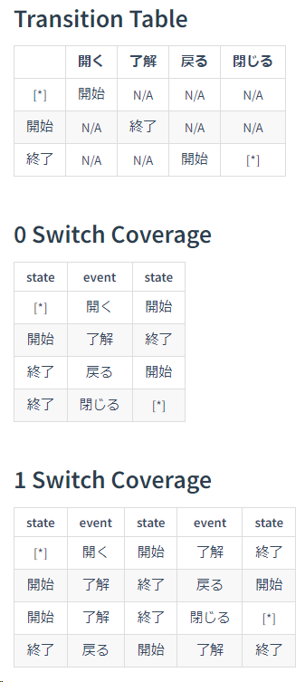

# State Diagram of PlantUML to State and N-switch Coverage Tables of Markdown and Copy it

PlantUML 形式で書いた状態遷移図から、Markdown 形式の状態遷移表と N-スイッチカバレッジ表を作成してクリップボードにコピーする拡張機能です。

## Features
次のような PlantUML の状態遷移図から、

```
@startuml
[*] -right-> 開始 : 開く
開始 -right-> 終了 : 了解
終了 -left-> 開始 : 戻る
終了 -right-> [*] : 閉じる
@enduml
```

次のような Markdown の表形式での状態遷移表と N-スイッチカバレッジ表を作成することができます。

```
## Transition Table

| |開く|了解|戻る|閉じる|
| :----: | :----: | :----: | :----: | :----: |
|[*]|開始|N/A|N/A|N/A|
|開始|N/A|終了|N/A|N/A|
|終了|N/A|N/A|開始|[*]|

## 0 Switch Coverage

|state|event|state|
| :----: | :----: | :----: |
|[*]|開く|開始|
|開始|了解|終了|
|終了|戻る|開始|
|終了|閉じる|[*]|

## 1 Switch Coverage

|state|event|state|event|state|
| :----: | :----: | :----: | :----: | :----: |
|[*]|開く|開始|了解|終了|
|開始|了解|終了|戻る|開始|
|開始|了解|終了|閉じる|[*]|
|終了|戻る|開始|了解|終了|

```

仕上がりでいうと


から



を作ることができます。

表での並び順は遷移図での並び順をなるべく意識しています。

## Usage

変換したい PlantUML の状態遷移図のテキストを選択した状態で `State Diagram 2 Markdown Tables And Copy` コマンドを実行すると、変換したテキストをクリップボードにコピーしますので、使いたいところで貼り付けてください。

PlantUML の状態遷移は

```
状態１ -> 状態２ : イベント
```

という形式のものを変換対象とします。

```
状態１ -> 状態２
```

というイベントの記述がないものは変換対象となりません。

```
state "名称" as 状態名
```

で状態の別名を指定している場合には、変換後の名称は別名の方が使われます。

## Requirements

特に依存関係はありません。

ただ、PlantUML 図のプレビューを Visual Studio Code でやりたい場合には、次のような拡張を入れてください。

- [Markdown Preview Enhanced](https://marketplace.visualstudio.com/items?itemName=shd101wyy.markdown-preview-enhanced)
- [PlantUML](https://marketplace.visualstudio.com/items?itemName=jebbs.plantuml)

どちらも [Java](http://java.com/en/download/) と [Graphviz](https://www.graphviz.org/) のインストールが必要になります。


## Extension Settings

* `stateDiagram2MarkdownTables.nSwitchCoveragesDepth`: N-スイッチカバレッジ表を作成する深さを指定できます（デフォルト＝1）

## Known Issues

今のところ特になし

## Release Notes

### 0.1.0

初期リリース
